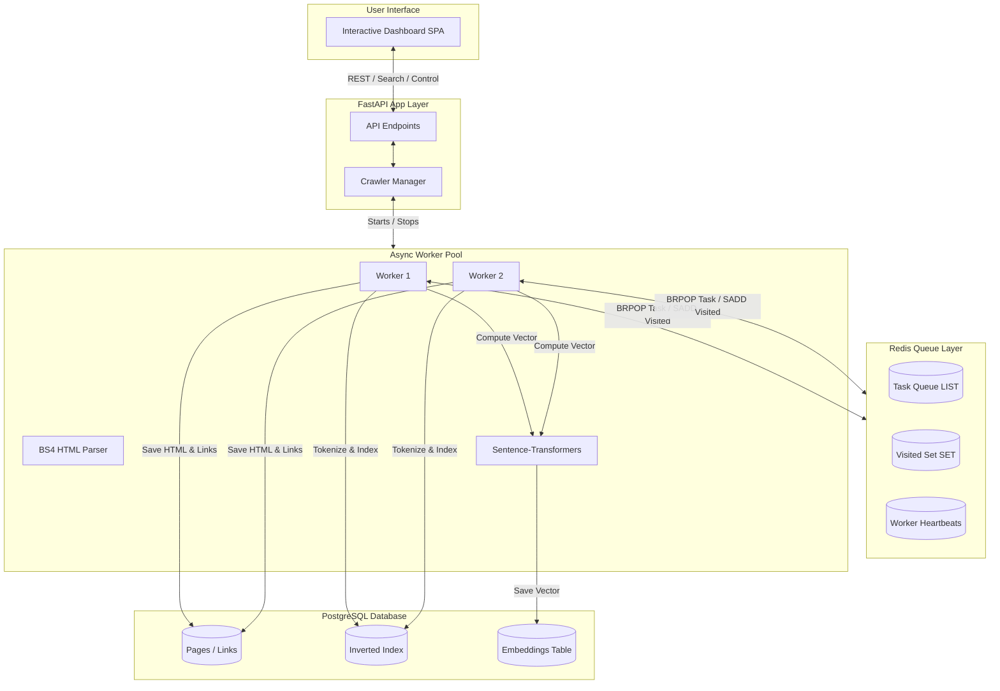
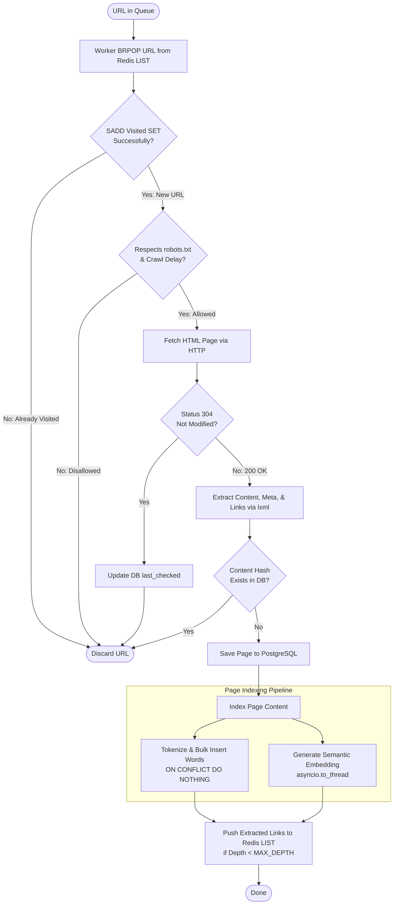
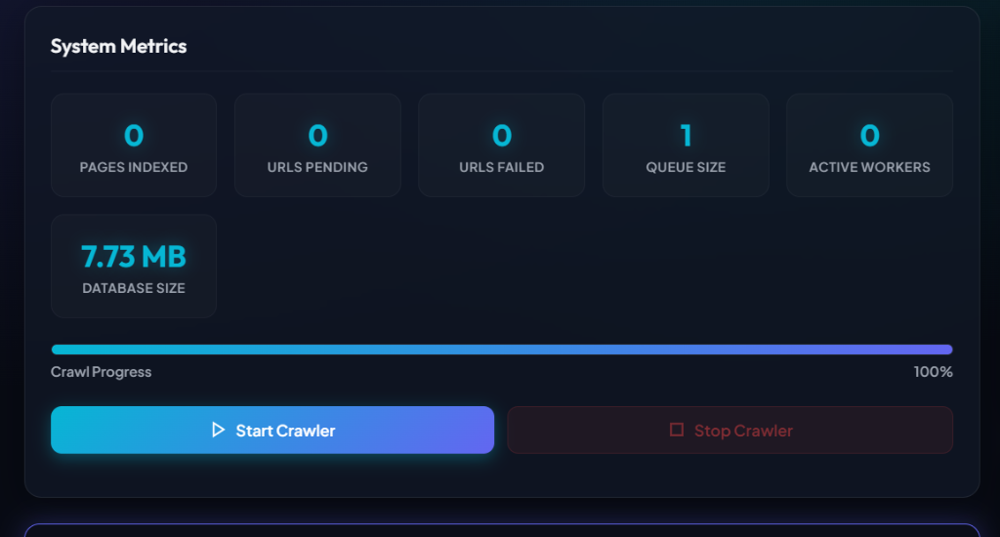
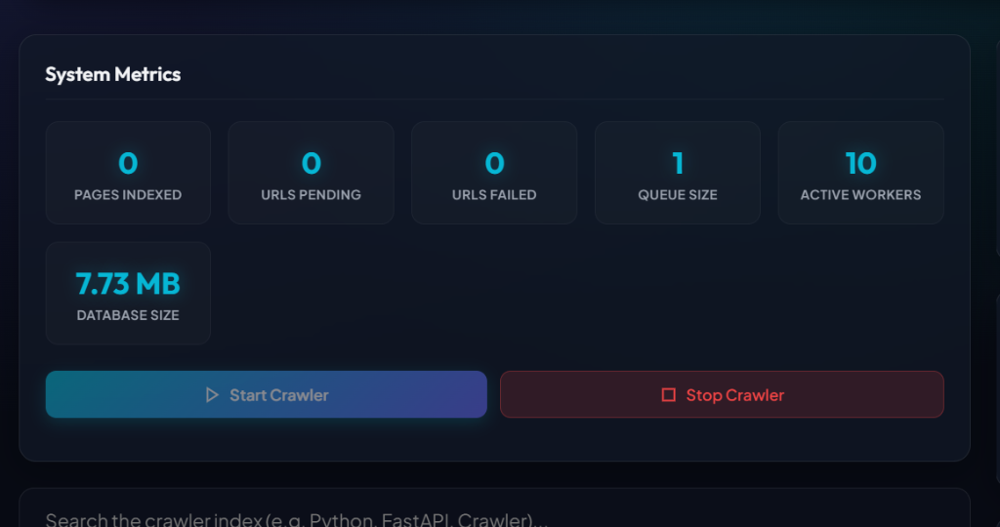
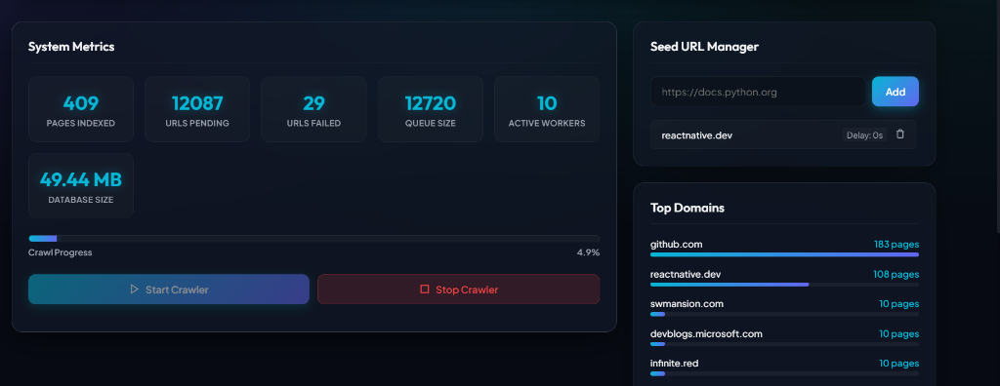

# PyCrawler - Distributed Web Crawler & Search Engine

PyCrawler is a distributed web crawler and full-text search engine built with **Python 3.13**, **FastAPI**, **Redis**, and **PostgreSQL**. The project is designed to demonstrate advanced concepts in distributed message queues, horizontal scaling, information retrieval (PageRank + TF-IDF), semantic vector search, and conditional caching headers.

It features an interactive **Single Page Dashboard (SPA)**, allowing users to control the crawler, view real-time statistics, search the database, and inspect crawled page content.

---

## 🚀 Key Features

*   **Distributed Async Crawling**: Asynchronous worker loops coordinate via Redis.
*   **Redis Task Queue**: Horizontal worker scaling via Redis `LIST` and visited history tracking via Redis `SET`.
*   **robots.txt Compliance**: Politeness delay management and checker caching.
*   **Incremental Crawling**: HTTP conditional headers (`If-None-Match`/`If-Modified-Since`) skip unchanged pages with `304 Not Modified`.
*   **Duplicate Detection**: Document body hashing using SHA-256 to prevent duplicate indices.
*   **PostgreSQL Storage**: Reliable async database persistence using SQLAlchemy + `asyncpg`.
*   **PageRank Link Analysis**: Global link authority score calculation using mathematical dangling node correction.
*   **TF-IDF + Semantic Search**: Blended candidate scores matching exact terms and vector embeddings (`all-MiniLM-L6-v2`).
*   **Interactive Dashboard**: Real-time progress monitoring, logs, and query recommendation box.
*   **Dockerized Deployment**: Clean orchestration using multi-stage builds.
*   **Automated Tests**: Unit testing suite running automatically via GitHub Actions CI.

---

## 🛠️ Technology Stack

*   **Backend**: FastAPI, Uvicorn, Python 3.13
*   **Distributed Queue**: Redis 7 (persistent)
*   **Database**: PostgreSQL 16
*   **HTML Parsing**: BeautifulSoup4 + `lxml`
*   **ORM & Connection**: SQLAlchemy 2.0 (Async) + `asyncpg`
*   **Embeddings Model**: Sentence-Transformers `all-MiniLM-L6-v2`
*   **Testing**: Python `unittest` (automated pipeline via GitHub Actions)
*   **Frontend**: Vanilla HTML5, CSS (Dark-mode theme), Javascript

---

## 📐 System Architecture



---

## 🔄 Worker Crawl Workflow

The flowchart below demonstrates the lifecycle of a URL task as it is processed by an active background worker:



---

## 📂 Project Structure

```text
pycrawler/
├── .github/
│   └── workflows/    # CI workflow running automated tests on commit
├── app/
│   ├── api/          # REST API endpoints (search, seeds, crawl controls, stats)
│   ├── config/       # Pydantic settings loading configuration
│   ├── crawler/      # Async workers & robots.txt checker
│   ├── database/     # Async database sessions & pool initialization
│   ├── indexing/     # Word extraction, TF calculator, & embedding upserts
│   ├── models/       # SQLAlchemy relational database models
│   ├── parser/       # HTML parsed content, links, & SHA-256 hashing
│   ├── queue/        # Redis queue controller & DB fallback managers
│   ├── ranking/      # Blended Ranker (TF-IDF + PageRank + Cosine Similarity)
│   ├── search/       # Alphanumeric tokenizer & custom stemmer
│   └── dashboard/    # Front-end dashboard user interface
├── docs/
│   └── screenshots/  # UI screenshots
├── scripts/
│   └── generate_mock_corpus.py # Local mock corpus generator
├── tests/            # Automated test suite (tokenizer, parser, ranker, pagerank)
├── Dockerfile        # Container setup utilizing the uv package manager
├── docker-compose.yml# Coordinated service stack configuration
├── requirements.txt  # Python requirements list
└── README.md         # Documentation
```

---

## 📸 Interface Screenshots

### Search UI and Query Telemetry


### Real-Time Crawl Metrics and Worker Telemetry


### In-Place Search Snippet Inspection


---

## 📦 Installation & How to Run

### Prerequisites
Make sure you have [Docker](https://www.docker.com/) and [Docker Compose](https://docs.docker.com/compose/) installed on your machine.

### 1. Launch Services
Start the compose stack from the project root:
```bash
docker-compose down -v
docker-compose up --build
```
This command automatically:
1. Boots persistent PostgreSQL and Redis containers.
2. Creates the schema and sets up database tables.
3. Starts the FastAPI web server on `http://localhost:8080/`.

### 2. Access the Application
Open your web browser and navigate to:
```text
http://localhost:8080/
```

### 3. Usage Steps
1. Add a seed URL (e.g., `http://host.docker.internal:8090/page_0.html` for local benchmarks) and click **Add**.
2. Click **Start Crawler** to initiate concurrent worker loops.
3. Wait for pages to crawl, then click **Compute PageRank** to calculate link authority scores.
4. Input queries in the search box. Suggestions will load dynamically. Press Enter to view ranked results.

---

## 🧪 Running Tests Locally

To run the unit tests inside a local virtual environment:

1. Create a virtual environment and install packages:
   ```bash
   python -m pip install uv
   ```
2. Set up virtual environment and install dependencies:
   ```bash
   python -m uv venv .venv
   .venv\Scripts\activate   # On Windows
   # source .venv/bin/activate on Linux/macOS
   python -m uv pip install -r requirements.txt
   ```
3. Run the test suite:
   ```bash
   .venv\Scripts\python -m unittest discover -s tests -v
   ```

---

## 🔗 Distributed Queue Design 

To enable horizontally scalable crawling without duplication, PyCrawler coordinates tasks using a Redis-backed queue system. 

1. **Horizontal Coordination**: Workers pop URLs using `BRPOP` (blocking list pop), guaranteeing that exactly one worker processes each task.
2. **O(1) Deduplication**: Before a URL is processed, workers perform an `SADD` operation on a Redis visited set. Since this runs in memory at sub-millisecond speeds, workers skip duplicate links instantly without performing slow SQL queries.
3. **Resilience**: Redis data is configured with background persistence (RDB snapshots), allowing the crawler queue to resume exactly where it left off in the event of worker or server restarts.

---

## 📊 Local Mock Corpus & Performance Benchmarks

To evaluate the crawler's performance under maximum concurrency and eliminate network variance (ISP throttles, network latencies, robots.txt blocks), the project includes a **synthetic web graph generator** and a local HTTP server for reproducible benchmarking.

### 1. Generate the Local Mock Web-Graph
Generate a synthetic corpus of **2,000 linked HTML pages** simulating a scale-free web graph (each containing 5–20 randomized outlinks and tech-themed text):
```bash
.venv\Scripts\python scripts\generate_mock_corpus.py
```

### 2. Start the Mock HTTP Web Server
Start a lightweight local server on the host machine to serve the generated corpus at sub-millisecond local network speeds:
```bash
.venv\Scripts\python -m http.server 8090 --directory mock_corpus
```

### 3. Run the Benchmark
1. In your browser at `http://localhost:8080/`, add the seed:
   ```text
   http://host.docker.internal:8090/page_0.html
   ```
2. Click **Start Crawler** in the UI.
3. In your terminal, run the telemetry and search query benchmark suite:
   ```bash
   .venv/Scripts/python benchmark.py
   ```

---

## 📈 Performance Benchmarks

Below are the benchmark metrics obtained from a full crawl and index run of the 2,000-page synthetic technical corpus:

| Metric | Measured Telemetry | Optimization Rationale |
| :--- | :--- | :--- |
| **Active Concurrent Workers** | **10 Workers** (Redis Heartbeats) | Improved worker resilience by recovering from transient database failures without interrupting active crawl workers. |
| **Peak Crawl Throughput** | **~300 pages/minute** | Asynchronous worker execution coordinated through Redis-backed task queues. |
| **Avg HTML Parse Speed** | **9.27 ms** | Reduced average HTML parsing time from ~3 s to ~9 ms by switching to the lxml parser and optimizing traversal. |
| **Avg DB Indexing Time** | **1,164 ms** | Shifted CPU-heavy `SentenceTransformer.encode` calls to a thread pool (`asyncio.to_thread`) and limited PyTorch to **1 thread per process** to eliminate CPU core thrashing. |
| **Vocabulary Word Count** | **1,985 distinct words** | Implemented PostgreSQL **`ON CONFLICT DO NOTHING`** bulk inserts to prevent duplicate word key violations during concurrent indexes. |
| **Median (P50) Search Latency** | **31.99 ms** | Hot-cached pre-calculated document embeddings and calculated cosine similarities using numpy matrix math. |
| **Search Query Success Rate** | **100.0%** | Successfully executed 100 benchmark queries over the generated corpus. |
